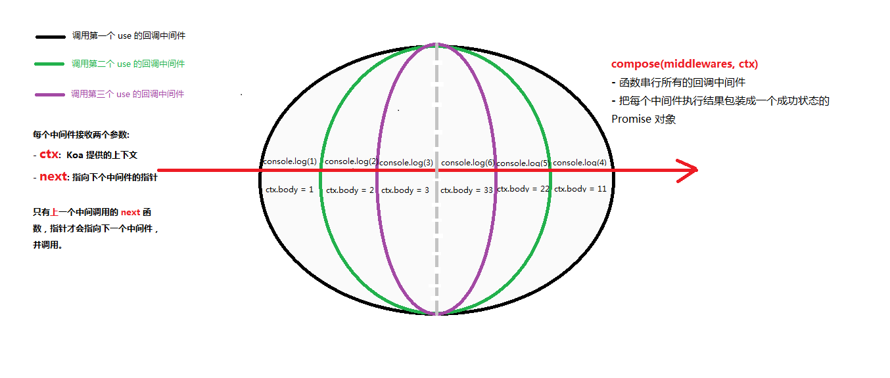

最近几天又把 `koa` 和 `express` 两个框架拿出来观摩，深知自己是一个前端小菜鸟，勤能补拙，还是决定在这个阴雨天的下午【已在家隔离近一个半月，学习修炼是香的】，把自己的心得记录下来。文中或有措辞不当，以及技术表述错误，欢迎各路大神点拨指正。

本篇文章以 `koa` 为中心。

# koa

## koa 简介
`koa` 是一个 web 开发框架，基于 `node` 内置模块 `http` 实现

*Koa is a new web framework designed by the team behind Express, which aims to be a smaller, more expressive, and more robust foundation for web applications and APIs. By leveraging async functions, Koa allows you to ditch callbacks and greatly increase error-handling. Koa does not bundle any middleware within its core, and it provides an elegant suite of methods that make writing servers fast and enjoyable.*

从上述官方介绍看：
- `koa` 和 `express` 都是出自同一个团队，旨在为 web 运用提供更小、更具表达、更强健的编程基础
- 不同于 `express`， `koa` 内部使用 `Promise` 对象，允许在外部使用 `async...await`实现异步的顺序操作，取代 `express` 中的回调函数
- 错误处理更加方便，`Koa` 类继承了 `events` 类，实现机制还是基于`发布/订阅`模式
- 内部并没有集成任何中间件，按需下载安装即可；相比 `express` 集成了所有可能用到的中间件，如: `static`, `body-parser`, `multer`, `views`, `express-session`, `cookie-parser`等中间件，这样文件更大，但无需用户自行下载。

## 运用
### 准备工作
```bash
- npm init 初始化 `package.json` 文件
- npm install koa -S 下载生产环境依赖的 `koa` 包
```

### 初始化文件
- 新建 app.js 运用文件
```js
const Koa  = require('koa');

const app = new Koa();

const Koa = require('./koa');

const app = new Koa();

app.use(async(ctx, next) => {
    console.log(1);
    ctx.body = '1';
    await next();
    ctx.body = '11';
    console.log(4);
});

app.use((ctx, next) => {
    console.log(2);
    ctx.body = '2';
    next();
    ctx.body = '22';
    console.log(5);
});

app.use((ctx, next) => {
    console.log(3);
    ctx.body = '3';
    next();
    ctx.body = '33';
    console.log(6);
});


app.on('err', console.log);

app.listen(3000);
```

打印结果：
```js
1
2
3
6
5
4
```

浏览器返回结果：
```js
11
```

### 总结特点：
- 基于 `node` 的 封装了 `req`, `res` 的方法， 内部只有三个核心功能 `use`、`listen`、`on('error')`
- `context` 即 `ctx` 上下文 是req和res的集合 (request,response)
- `request` 自己的封装的请求的方法
- `response` 自己封装的响应方法

## 实现
### 从上数实践来看，`koa` 的中间件调用类似一个`洋葱`模型，见下图：


### 目录结构
```js
koa
        | application.js
    | lib
        | context.js
        | request.js
        | response.js
    | package.json
```

### coding
#### `package.json`
```js
{
    "main": "lib/application.js",
}
为 `koa` 包确定入口文件。
```

#### `application.js`
```js
const Emitter = require('events');
const http = require('http');
const context = require('./context');
const response = require('./response');
const request = require('./request');
const Stream = require('stream');

module.exports = class Koa extends Emitter{
    constructor() {
        super();
        this.middlewares = [];
        this.context = Object.create(context);
        this.response = Object.create(response);
        this.request = Object.create(request);
    }

    use(middleware) {
        this.middlewares.push(middleware);
    }
    
    handleRequest(req, res) {
        const ctx = this.createContext(req, res);
        ctx.statusCode(404);
        this.compose(this.middlewares, ctx)
            .then(() => {
                let body = ctx.body;
                if (body instanceof Stream) {
                    body.pipe(res);
                } else if (typeof body === 'object'){
                    ctx.set('Context-Type', 'application/json');
                    res.end(JSON.stringify(body));
                } else if (typeof body === 'string' || Buffer.isBuffer(body)) {
                    res.end(body);
                } else {
                    res.end('Not Found')
                }
            }, err => {
                this.emit('error', err);
                ctx.statusCode(500);
                ctx.end('Internal Server Error')
            })
    }
    
    compose(middlewares, ctx) {
        function dispatch(index) {
            if (index === middlewares.length) return Promise.resolve();
            try {
                return Promise.resolve(middlewares[index](ctx, () => dispatch(index +1)));
            } catch(err) {
                return Promise.reject(err);
            }
        }
        return dispatch(0);
    }

    createContext(req, res) {
        const context = Object.create(this.context);
        const request  = context.request = Object.create(this.request);
        const response =  context.response = Object.create(this.response);
        context.req = request.req = req;
        context.res =  response.res = res;
        return context;
    }

    listen(...args) {
        const server = http.createServer(this.handleRequest.bind(this));
        return server.listen(...args);
    }
}
```

#### `context.js`
```js
const proto = {};

function defineGetter(property, key) {
    proto.__defineGetter__(key, function() {
        return this[property][key];
    })
}

function defineSetter(property, key) {
    proto.__defineSetter__(key, function(newValue) {
        this[property][key] = newValue;
    })
}


defineGetter('request', 'method');
defineGetter('request', 'path');
defineGetter('response', 'body');
defineGetter('response', 'set');
defineGetter('request', 'params');
defineGetter('response', 'statusCode');

defineSetter('response', 'body');


module.exports = proto;
```

#### `request.js`
```js
const url = require('url');
const querystring = require('querystring');

module.exports = {
    get method() {
        return this.req.method;
    },

    set method(val) {
        this.req.method = val;
    },

    get path() {
        // Url {
        //     protocol: null,
        //     slashes: null,
        //     auth: null,
        //     host: null,
        //     port: null,
        //     hostname: null,
        //     hash: null,
        //     search: '?id=1',
        //     query: 'id=1',
        //     pathname: '/get',
        //     path: '/get?id=1',
        //     href: '/get?id=1'
        //   }
        const { pathname, query } = url.parse(this.req.url);
        this._params = querystring.parse(query);
        return pathname;
    },

    get params() {
        return this._params;
    },

    get url() {
        return this.req.url;
    },

}
```

#### `response.js`
```js
module.exports = {
    _body: undefined,

    get header() {
        const { res } = this;
        return res.getHeaders();
    },

    get headers() {
        return this.header;
    },

    get status() {
        return this.res.statusCode;
    },

    get body() {
        return this._body;
    },

    set body(val) {
        this.statusCode(200);
        this._body = val;
    },
    
    statusCode(newValue) {
        this.res.statusCode = newValue;
    },

    set(...args) {
        console.log(args);
        this.res.setHeader(...args);
    }
}
```